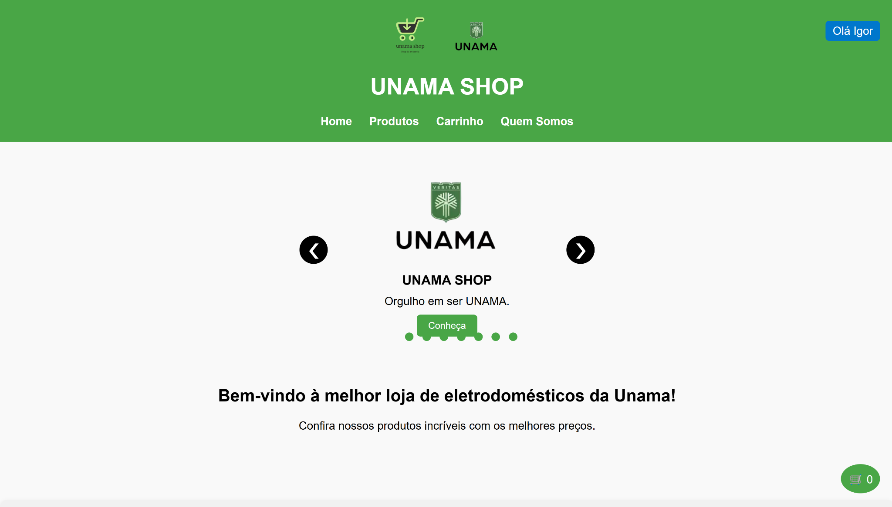
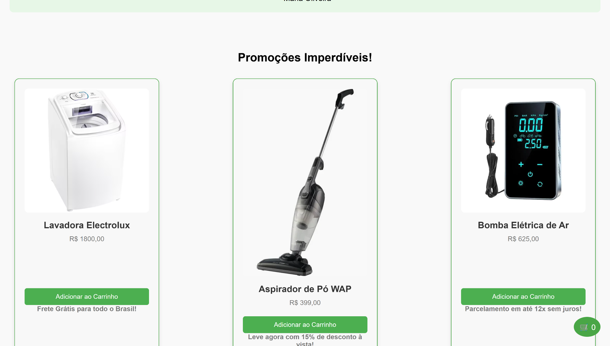
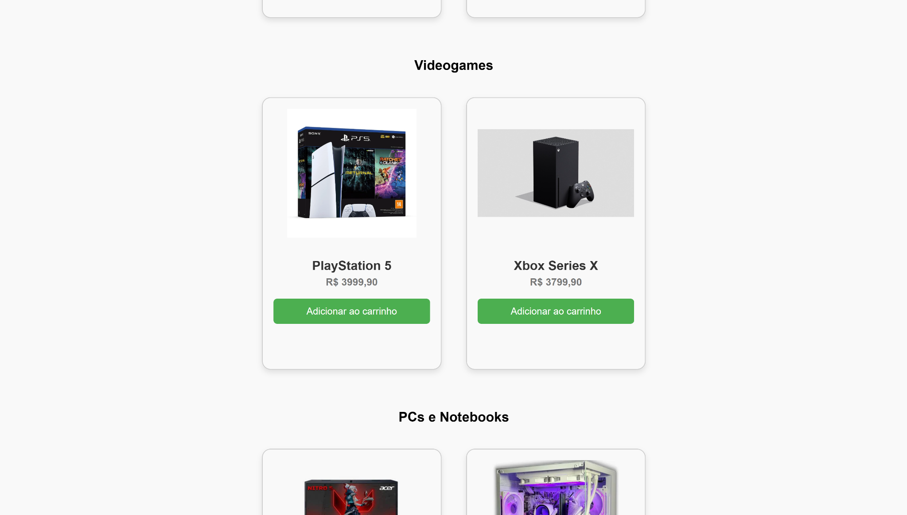
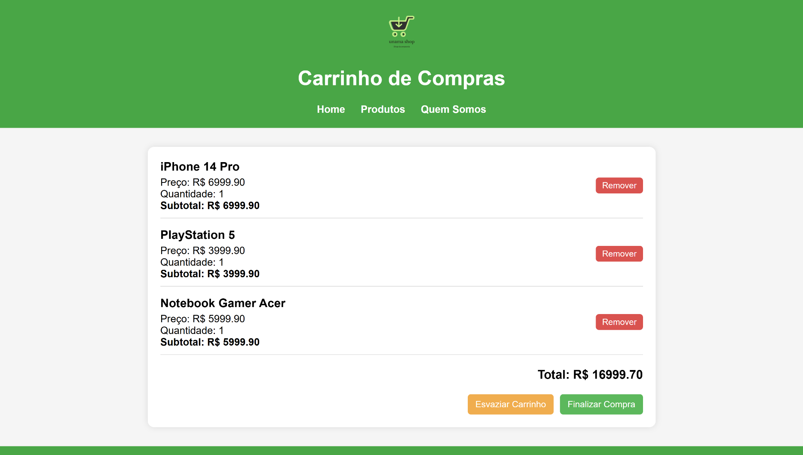

# 🛍️ UNAMA SHOP – Sua Loja de Eletrodomésticos e Eletrônicos Online

**UNAMA SHOP** é um site de comércio eletrônico desenvolvido como projeto acadêmico, com foco na venda de **eletrodomésticos** e **eletrônicos**. Totalmente construído com tecnologias de front-end (HTML, CSS e JavaScript), o site oferece uma navegação moderna, intuitiva e responsiva — tudo sem necessidade de back-end.



---

## 🚀 Funcionalidades Principais

✨ Uma experiência completa de e-commerce no front-end, incluindo:

- 🎞️ **Carrossel de Imagens Promocionais** na página inicial  
- 🔐 **Sistema de Login e Cadastro** (simulado no navegador)  
- 🛍️ **Catálogo de Produtos** com destaques e categorias  
- 🛒 **Carrinho de Compras** com persistência via `localStorage`  
- 📌 **Botão Flutuante do Carrinho**, sempre acessível  
- 📱 **Design Responsivo** adaptado a todos os dispositivos

---

## 👨‍💻 Equipe de Desenvolvimento

Uma equipe dedicada à criação de uma experiência digital fluida e visualmente atrativa:

- **Kaio Márcio** – *Desenvolvedor Front-End*  
  > Responsável pela estrutura HTML, estilização CSS, carrossel, animações e interações JavaScript (incluindo o carrinho de compras).

- **Anthony Cardoso** – *Designer de Interface (UI/UX)*  
  > Cuidou da identidade visual do site, escolha de cores, tipografia e responsividade para melhor usabilidade.

- **Gabryella Gonçalves** – *Organizadora de Conteúdo*  
  > Criou os textos, nomes de produtos, seções e descrições promocionais com foco em clareza e persuasão.

- **Rafael Rocha** – *Documentador do Projeto*  
  > Responsável pela documentação técnica do site, explicando a estrutura dos arquivos, funcionalidades e instruções de uso.

---

## 🛠️ Tecnologias Utilizadas

- 🧱 **HTML5** – Estrutura semântica e acessível  
- 🎨 **CSS3** – Estilização moderna e responsiva  
- ⚙️ **JavaScript** – Lógica interativa e gerenciamento de dados com `localStorage`

---

## 📸 Galeria de Telas

> Uma amostra visual da experiência UNAMA SHOP:

### 🏠 Página Inicial  


### 🛒 Seção de Produtos  


### 📌 Botão Flutuante do Carrinho  


### 🧾 Carrinho de Compras  


---

## 💻 Exemplos de Código

### 📦 HTML – Carrossel de Produtos

```html
<!-- Carrossel de Produtos -->
<div class="carousel">
  <div class="slide active">
    
  </div>
  <div class="slide">
    
  </div>
</div>
```

---

### 🎨 CSS – Botão Flutuante do Carrinho

```css
#cart-float {
  position: fixed;
  bottom: 20px;
  right: 20px;
  background-color: #ff6600;
  color: white;
  padding: 15px;
  border-radius: 50%;
  cursor: pointer;
  box-shadow: 0 4px 8px rgba(0,0,0,0.2);
}
```

---

### ⚙️ JavaScript – Adicionar Produto ao Carrinho

```javascript
// Função para adicionar produto ao carrinho
function adicionarAoCarrinho(idProduto) {
  let carrinho = JSON.parse(localStorage.getItem("carrinho")) || [];
  carrinho.push(idProduto);
  localStorage.setItem("carrinho", JSON.stringify(carrinho));
  atualizarIconeCarrinho();
}
```

---

## 📘 Observações Finais

Este projeto demonstra como é possível construir um e-commerce funcional com **apenas tecnologias de front-end**, simulando recursos reais compras e organização de produtos.

> **© 2025 UNAMA SHOP** – Todos os direitos reservados.  


